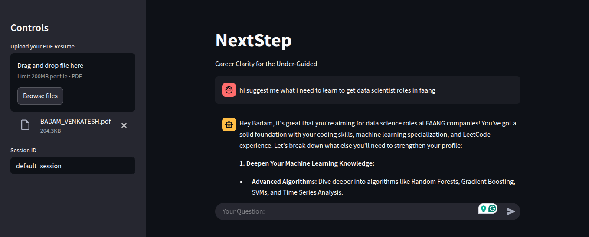

# 🧠 NextStep - Career Clarity for the Under-Guided

**NextStep** is a GenAI-powered career guidance chatbot built using LangChain, RAG (Retrieval-Augmented Generation), and LLMs like Groq's Gemma. It provides intelligent, context-aware, and resume-personalized responses to career-related questions — just like a real mentor.

---

## 💡 Features

- 🔍 Personalized Q&A from your uploaded resume
- 🧾 Multi-session chat history (like ChatGPT)
- 🎓 Career roadmaps for roles like “Data Scientist at Google”
- 🛠️ Skill suggestions and guidance based on user profile
- 💬 Human-like, structured, step-by-step responses
- 🧠 History-aware retriever (contextual memory)

---

## 🚀 Tech Stack

| Category            | Tools & Frameworks                                       |
|---------------------|----------------------------------------------------------|
| 🧠 LLM               | [Groq Gemma-2 9B](https://groq.com)                     |
| 📚 RAG & Chains      | [LangChain](https://www.langchain.com/)                |
| 🧾 Embeddings        | HuggingFace - `all-MiniLM-L6-v2`                        |
| 🔎 Vector DB         | Chroma                                                  |
| 📄 PDF Reader        | LangChain `PyPDFLoader`                                 |
| 🧠 Context Management| RunnableWithMessageHistory, ChatMessageHistory         |
| 🧪 UI Framework      | Streamlit                                               |

---

## 📷 Sample Dashboard



---

## 🛠️ How It Works

1. **Upload Your Resume (PDF)**  
   → It gets embedded and stored in a vector DB (Chroma).

2. **Ask Questions**  
   → RAG retrieves context chunks relevant to the question.

3. **LLM Processes Context**  
   → A structured and human-like answer is generated.

4. **Multi-Session Chat**  
   → You can start new sessions or revisit previous ones.

---

## 🧑‍💻 Getting Started

### 🔧 Setup Instructions

```bash
# 1. Clone the repository
git clone https://github.com/Venkatesh2007/NextStep.git
cd NextStep

# 2. Create and activate a virtual environment
python -m venv venv
source venv/bin/activate  # On Windows: venv\Scripts\activate

# 3. Install dependencies
pip install -r requirements.txt

# 4. Set your environment variables in a .env file
touch .env
# NextStep
.env file
GROQ_API_KEY=your_groq_api_key_here
HF_TOKEN=your_huggingface_token_here

# 5. Run the App
streamlit run app.py
```

## 🤖 Example Queries
- "What skills do I need to become a Data Scientist at Google?"

- "Based on my resume, what are the best job roles I should aim for?"

- "Suggest certifications to transition from Frontend to ML Engineer."

## 📂 Folder Structure
```
NextStep/
│
├── app.py
├── requirements.txt
├── .env
├── spark_dashboard.png
└── README.md
```
## Author

**Badam Venkatesh**  
💼 AI Enthusiast | Builder of GenAI + Career Tools  
📬 [LinkedIn](https://www.linkedin.com/in/badamvenkatesh/) | 🌐 [Portfolio](https://badam-portfolio.netlify.app)


